# VocabWizard &#128293;
Entwickelt von: <b>Johannes Graf</b>

## Inhaltsverzeichnis
    1) Anforderungen an die Applikation
    2) Anleitung zum Ausführen der Applikation
    3) Anleitung zur Nutzung der Applikation
    4) Technische Details

## Anforderungen an die Applikation
- Der Nutzer möchte englische Vokablen mit Karteikarten lernen. Hierzu sollen Wörter von Deutsch, Französisch, Italienisch und Spanisch in Englisch übersetzt werden können und andersherum auch ein englisches Wort in Deutsch, Französisch, Italienisch und Spanisch.
- Der Nutzer kann sich einfach einen Account erstellen und über Name und Passwort jederzeit anmelden
- Der Nutzer bleibt für 7 Tage angemeldet, auch wenn der Browser neugestartet wird
- Der Nutzer muss nur ein Wort in der jeweiligen Sprache eingeben, im Hintergrund wird nach Übersetzung, Definitionen, Beispielsätze, Synnonyme und Gegenteile für das Wort für eine bessere Lernerfahrung gesucht.
- Um seine Karteikarten strukturieren zu können, kann der nutzer die Karteikarten in sogenannten Decks organisieren.
- Für jedes Deck kann der Nutzer über die Lern-Rate konfigurieren, wie viele neue Karten pro Tag gelernt werden sollen.
- Der Nutzer kann für die Decks einsehen, wie viele neue Karten am aktuellen Tag zu lernen sind und wie viele bereits gelernte Karten am aktellen Tag zu wiederholen sind.
- Der Nutzer kann nach Erstellung des Decks noch Eigenschaften wie Name oder Lern-Rate modifizieren.
- Decks und Karteikarten können gelöscht werden.
- Der Nutzer kann während dem Lernen der Karteikarten auswählen wie gut er das Wort beherrscht. Basierend darauf berechnet ein Algorithmus im Hintergrund einen passenden Zeitpunkt, wann die Karte wiederholt werden soll.
- Die Nutzer können die Decks mitsamt der Karten von anderen Nutzern importieren.
- Der Nutzer kann die Vorder- und Rückseite aller Karten eines Decks mit minimalem Aufwand vertauschen.
- Der Nutzer kann über eine Visualisierung einsehen, wie gut er die Karten seines Decks beherrscht.
- Der Administrator ist im Gegensatz zu normalen Nutzern in der Lage auf Nutzer-Verwaltung zuzugreifen und andere Nutzer zu löschen.
- Da Karteikarten oft unterwegs gelernt werden soll die Applikation auch für moblie Endgeräte angenehm zu bedienen sein.

## Anleitung zum Ausführen der Applikation
<b>Alle folgenden Befehle basieren auf Node Version v18.18.0 und npm Version 10.2.0.</b>

### Backend ausführen
- Backend Git-Repository clonen: `$ git clone https://github.com/Graf-J/vocabwizard-server.git`
- In das Projekt navigieren: `$ cd vocabwizard-server`
- Eine Datei mit dem Namen `.env` mit dem folgenden Inhalt im aktuellen Verzeichnis erstellen
```
MONGO_URI=mongodb://localhost:27017
JWT_SECRET=MySuperSecretJWTString
LIBRE_TRANSLATE_URL=http://localhost:5000
DICTIONARY_API_URL=https://api.dictionaryapi.dev
```

- Den folgenden Befehl im aktuellen Verzeichnis ausführen, um die Dependencies zu installieren: `$ npm install`
- Bei möglichen Vulnerabilities den folgenden Befehl ausführen `$ npm audit fix` um diese zu fixen.
- Mit `$ cd ..` ein Verzeichnis nach oben navigieren und dort eine Datei namens `docker-compose.yaml` mit folgendem Inhalt erstellen
```
version: "3.9"
services:
  libretranslate:
    container_name: libtranslate
    image: libretranslate/libretranslate:v1.5.5
    healthcheck:
      test: ['CMD-SHELL', './venv/bin/python scripts/healthcheck.py']
    mem_limit: 4g
    security_opt:
      - no-new-privileges:true
    ports:
      - 5000:5000
    environment:
      LT_LOAD_ONLY: de,en,it,es,fr
    restart: on-failure:5

  mongodb:
    container_name: mongo
    image: mongo
    environment:
      MONGO_INITDB_ROOT_USERNAME: ""
      MONGO_INITDB_ROOT_PASSWORD: ""
    volumes:
      - mongodb_data:/data/db
    ports:
      - 27017:27017
    restart: always

volumes:
  mongodb_data:
```
- Mit Docker können die beiden Services über `$ docker-compose up -d` nun gestartet werden. Der LibreTranslate Container lässt sich beim ersten mal starten immer etwas Zeit bis er läuft. Auch wenn Docker den Container als running markiert benötigt der Container im Hintergrund noch einen Moment bis er tatsächlich läuft (kann ein paar Minuten dauern). Der Container ist erst vollständig hochgefahren, wenn er über http://localhost:5000 erreichbar ist.
- Nachdem die Container gestartet wurden, kann wieder in das Projekt navigiert werden `$ cd vocabwizard-server` um die tatsächliche NestJS Applikation mit `$ npm run start` zu starten.
- Wenn alles funktioniert hat, müsste auf http://localhost:3000/api der Swagger der Applikation einsehbar sein.

### Backend Deploy
Ich bin im vorherigen Punkt davon ausgegangen, dass es zum Prüfen der Applikation angenehmer ist diese manuell zu starten. Ich habe jedoch auch eine Möglichkeit vorgesehen das Backend als Docker-Container zu starten, um es beispielsweise auf einem Server zu veröffentlichen. Hierzu müssen die folgenden Schritte im Vergleich zum vorangegangenen Punkt abgeändert werden:

- Die `.env`Datei muss auf die folgende Inhalte abgeändert werden:
```
MONGO_URI=mongodb://mongodb:27017
JWT_SECRET=MySuperSecretJWTString
LIBRE_TRANSLATE_URL=http://libretranslate:5000
DICTIONARY_API_URL=https://api.dictionaryapi.dev
```
- Nun muss die `docker-compose.yaml` Datei im root-Verzeichnis der Backend-Applikation die schon vom Repository heruntergeladen wurde mit `$ docker-compose up -d` gestartet werden.
- Wenn alles funktioniert hat, müsste auf http://localhost:3000/api der Swagger der Applikation einsehbar sein.

### Backend Unittests
Die Unittests verwendet eine In-Memory-Datenbank und mockt alle Zugriffe auf externe APIs und Services. Somit sind die Unittests ausführbar, ohne dass irgend ein Docker-Container laufen muss und sind komplett unabhängig.
Die Unittests können mit `$ npm run test` im Verzeichnis der Backend Applikation ausgeführt werden.

### Backend E2E-Tests
Die E2E-Tests verwenden ebenfalls die In-Memory-Datenbank und mockt alle Zugriffe auf exteren APIs und Services. Somit können auch diese komplett unabhängig mit `$ npm run test:e2e` im Verzeichnis der Backend  Applikation ausgeführt werden.

### Backend Compodoc
Mit dem Befehl `$ npm run compodoc` im Verzeichnis des Backends kann Compodoc ausgeführt werden. Die Dokumentation is dann über http://127.0.0.1:8080 einsehbar.

### Frontend ausführen
- Das Frontend Git-Repository clonen `$ git clone https://github.com/Graf-J/vocabwizard-website.git`
- In das Projekt navigieren `$ cd vocabwizard-website`
- Dependencies installieren `$ npm install`
- Bei möglichen Vulnerabilities den folgenden Befehl ausführen `$ npm audit fix` um diese zu fixen.
- Die Webseite starten `npm run start`
- Wenn alles funktioniert hat, sollte die Webseite über http://localhost:4200 erreichbar sein
- Um mit der Webseite zu interagieren muss natürlich das Backend ebenfalls bereits gestartet sein

### Frontend Tests ausführen
Ich habe sämtliche Komponenten angepasst, sodass die nativ von Angular bereitgestellten Tests mit `$ npm run test` ohne Fehlermeldungen ausgeführt werden können. Ich habe diese Tests dazu verwendet um Teile meiner Applikation zu testen die mit Logik zu tun haben. Da ich die Buisiness-Logik zu einem großen Teil in das Backend ausgelagert habe werden hier eigentlich nur die Authentifizierungs-Logik geprüft. Die Tests sind völlig unabhängig vom Backend ausführbar.

### Frontend E2E-Test ausführen
Für das End-2-End Testen des Frontends habe ich Cypress aufgesetzt. Auch hier agiert die Website komplett unabhängig vom Backend und mockt jegliche Zugriffe auf externe Schnittstellen. Cypress kann über `$ npm run cypress` gestartet werden. In dem geöffneten Fenster muss die Schaltfläche <b>E2E Testing</b> ausgewählt werden. Dannach können die Tests in einem Browser (ich habe immer Chrome verwendet) eingesehen und ausgeführt werden.

## Anleitung zur Nutzung der Applikation
Startet man die Applikation landet man zunächst auf dem Login-Screen, auf welchem man sich anmelden kann falls man einen Account hat.<br>
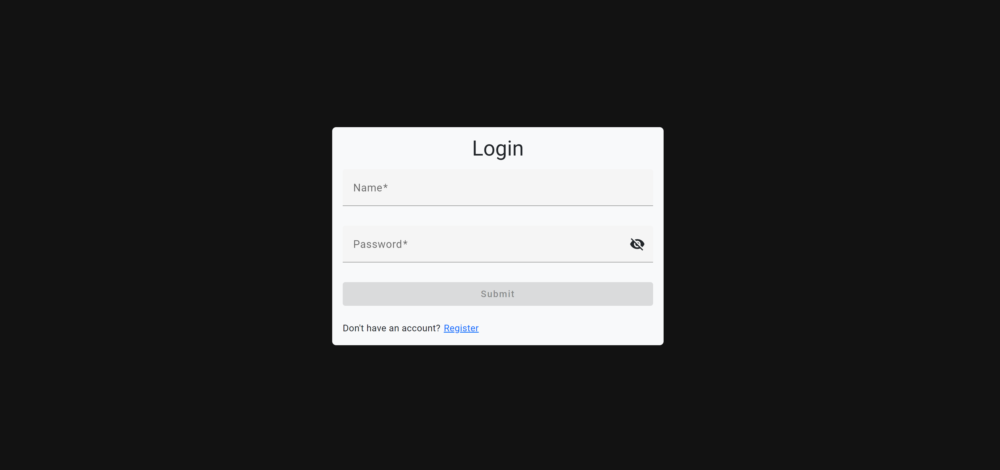<br>
Über einen Klick auf <b>Register</b> navigiert man auf den Register-Screen, um sich einen Account zu erstellen.<br>
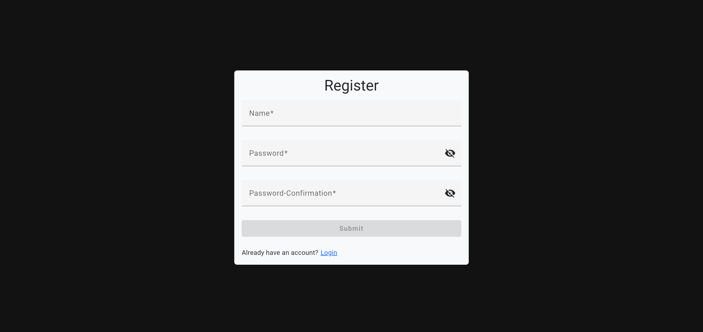<br>
Der erste Nutzer der registriert wird ist automatisch immer der Admin Nutzer. Nach erfolgreicher Registrierung landet man auf der folgenden Übersichtsseite.<br>
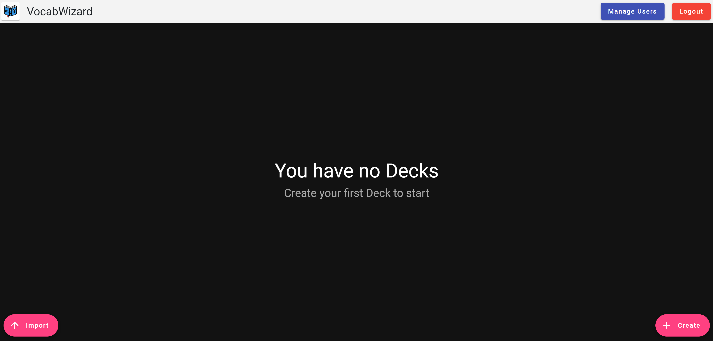<br>
Oben im Bildschirm ist der Header zu erkennen. Mit einem Klick auf das Logo oder den text <b>VocabWizard</b> kann jederzeit auf die Übersichtsseite navigiert werden. Auf der rechten Seite des Headers kann sich der Nutzer ausloggen. Neben dem Logout-Knopf ist für den Admin ein <b>Manage Users</b> Knopf sichtbar, über welchen man zu Nutzerverwaltung navigiert.<br>
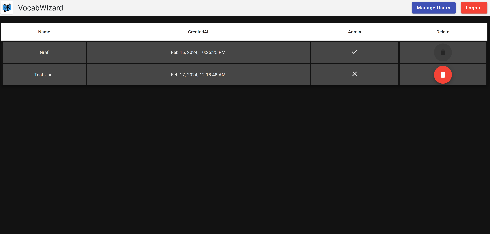<br>
Hier kann man sich die verschiednen Nutzer welche auf der Webseite angemeldet sind zusammen mit ein paar Daten in einer Tabelle ansehen. Man kann nutzer über den roten Knopf zusammen mit allen Decks und Karteikarten löschen. Sich selbst kann der Admin natürlich nicht löschen, weshalb der Löschen-Knopf dort deaktiviert ist. Mit einem Klick auf das Logo links oben wird wieder auf die Übersichts-Seite zurücknavigiert.<br>
<br>
Über den <b>Create</b> Knopf rechts unten navigiert man auf eine Seite auf welcher man sich sein erstes Deck erstellen kann.<br>
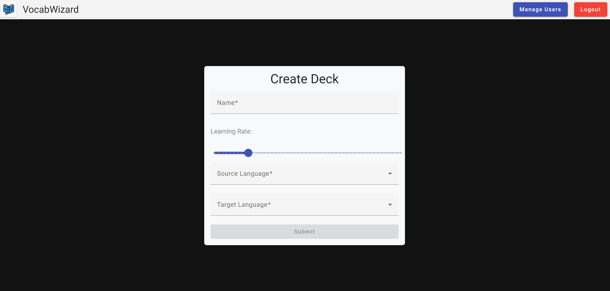<br>
Der Name bestimmt den Name des Decks. Die Lerning-Rate legt fest, wie viele neue Karten der Nutzer maximal pro Tag in diesem Deck lernen möchte. Die Source-Language und Target-Langage legen fest von welcher in welche Sprache die Karten des Decks gelernt werden sollen. Nach dem erstellen des Decks erscheint dieses auf der Übersichtsseite<br>
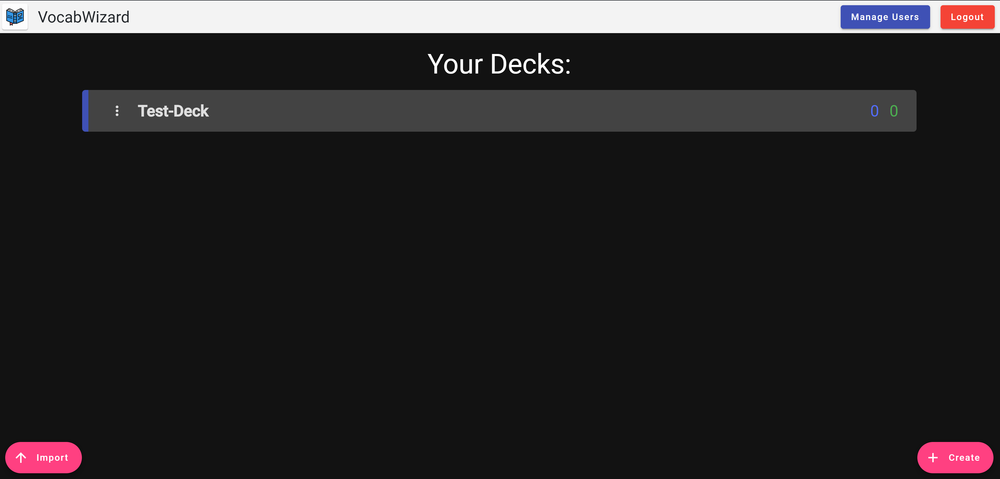<br>
Um nun Karten zu dem Deck hinzufügen zu können muss auf die drei Punkte links neben dem Decknamen geklickt werden. Es erscheint ein Menü mit Optionen die für das Deck verfügbar sind. Mit der ersten Option <b>Add Card</b> gelangt man auf eine Seite über welche ein Wort in der für das Deck konfigurierten Sprachen hinzugefügt werden kann.<br>
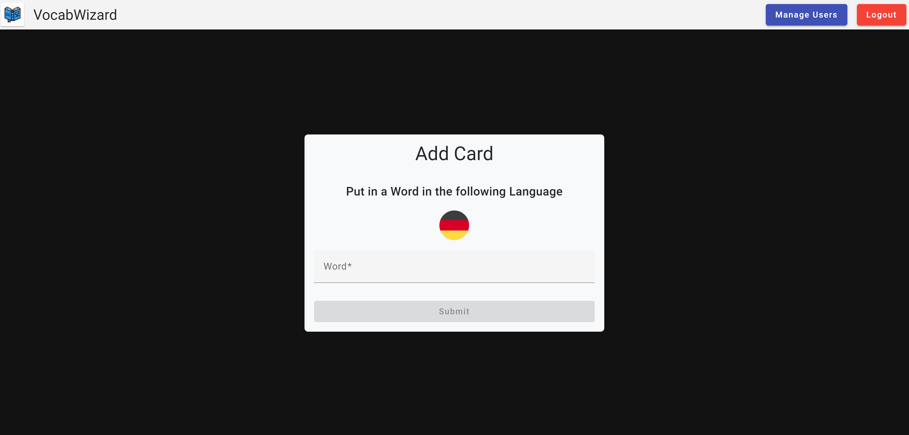<br>
Nachdem ein Wort in der angezeigten Sprache hinzugefügt wurde kann durch einen Klick auf das Logo links oben wieder auf die Übersichtsseite navigiert werden. Dort erscheint nun eine grüne eins die bedeutet, dass es für heute eine neue Karte zu lernen gibt. Die blaue null bedeutet, dass es keine Karten für das Deck gibt, welche schon einmal in der Vergangenheit gelernt wurden und heute wiederholt werden müssen. Wenn man mit dem Mauszeiger über die Zahlen fährt wird das ganze auch beschrieben.<br>
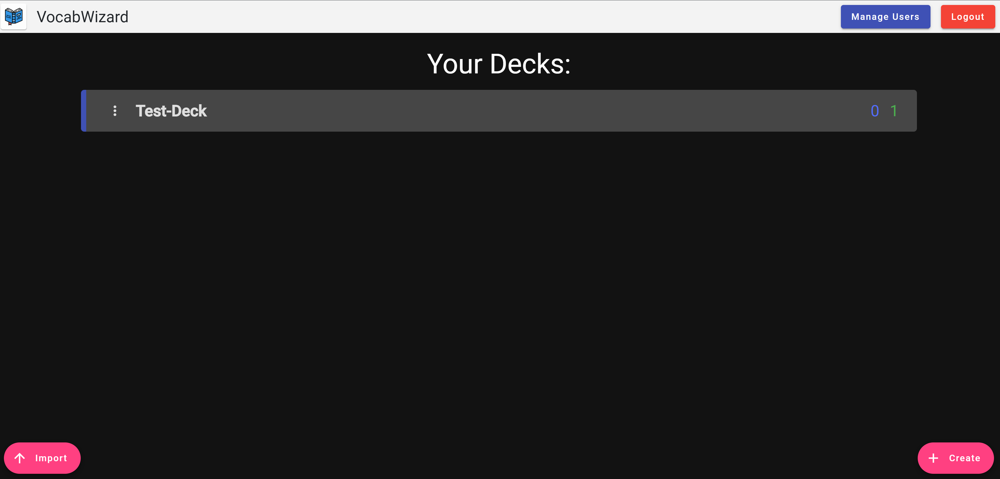<br>
Wenn bei mindestens einer der beiden Zahlen keine null steht sind für heute Karten zum lernen verfügbar. Mit einem Klick auf auf das Test-Deck kann zum Lern-Screen navigiert werden. Hier erscheint zunächst die Vorderseite der ersten Karteikarte welche man lernen möchte.<br>
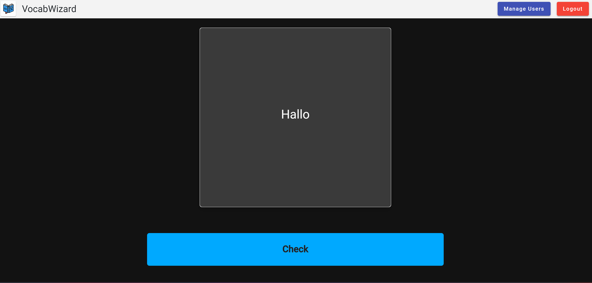<br>
Mit einem Klick auf <b>Check</b> kann die Rückseite der Karte und somit die Lösung eingesehen werden.<br>
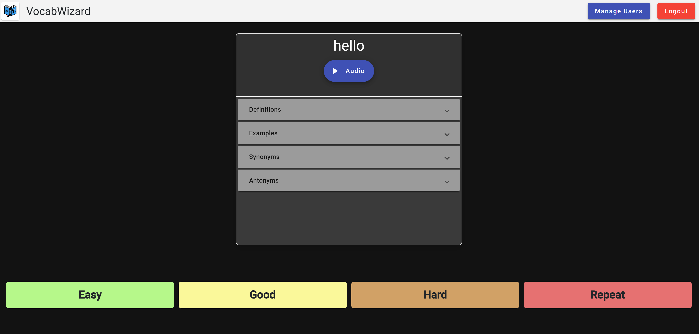<br>
Man sieht, wie für das zuvor eingegebene Wort <b>Hallo</b> automatisch im Hintergrund eine Übersetzung mit anderen hilfreichen Informationen generiert wurde. Über die Knöpfe um unteren Bereich kann ausgewählt werden wie gut man die Karteikarte beantworten konnte. Bei einem Klick auf <b>Repeat</b> wird die Karte sozusagen hinten angereiht und immer wieder abgefragt. Für alle anderen Optionen berechnet ein Algorithmus entsprechend wie gut man angibt die Karte zu können, in wie vielen Tagen die Karte dem Nutzer zur Wiederholung das nächste mal angeboten wird.<br>
Wieder zurück auf der Übersichtseite erkenn man, dass die grüne eins nach dem Lernen verschwunden ist.<br>
<br>
Öffnet man wieder das Menü des Decks sieht man, dass als zweite Option die ID des Decks kopiert werden kann. Diese ID kann von an einen anderen Nutzer gesendet werden um ein Deck von jemand anderem zu importieren. Da es verboten ist seine eingenen Decks zu importieren muss zum Testen hier ein neuer Nutzer angelegt werden und dann auf den Knopf <b>Import</b> unten links geklickt werden. Dann erscheint ein Eingabefeld in welches man die ID einfügen kann um das Deck zu importieren.<br>
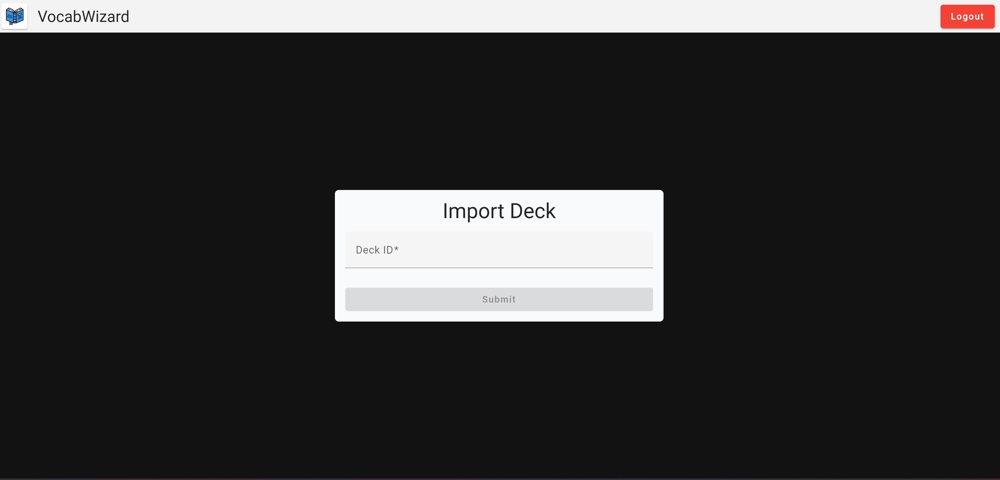<br>
Es ist zu beachten, dass das Deck komplett frisch kopiert wird. Das heißt die Karten die von einem anderen Nutzer möglicherweise schon gelernt wurden erscheinen hier logischerweise als komplett neue Karten die heute neu gelernt werden müssen.<br>
Die über die dritte Option eines Decks auf der Übersichtsseite kann man sich Statistiken ansehen, wie gut man wie viele Karten aus dem Deck beherrscht. Zu Beginn sieht das Diagramm vermutlich sehr langweilig und eintönig aus, mit mehrerern Karten die man über eine längere Zeit lernt könnte es aber einmal wie hier abgebildet aussehen.<br>
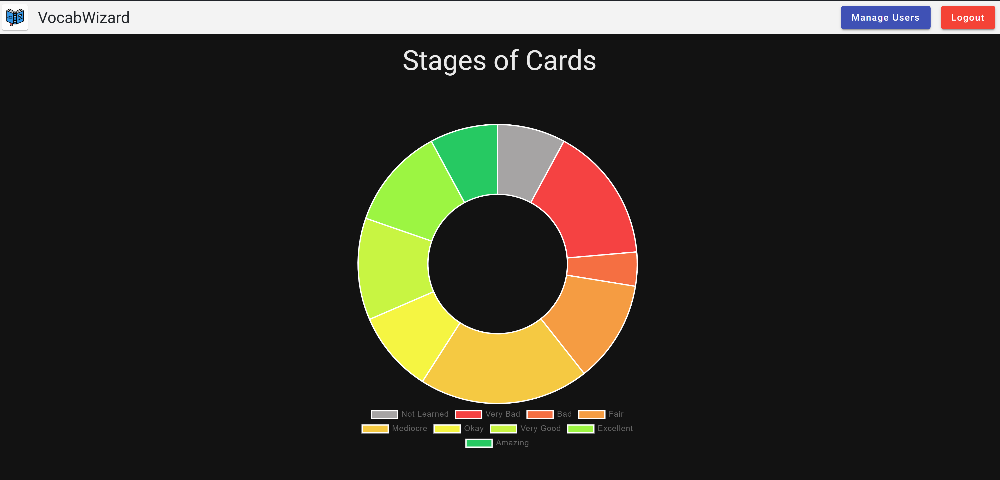<br>
Mit der Option <b>Update Deck</b> navigiert man auf eine Seite, auf welcher der Name und die Learning-Rate des Decks angepasst werden können.<br>
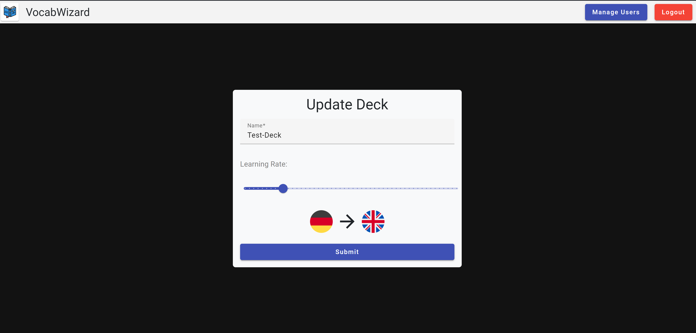<br>
Mit der Option <b>View Cards</b> können die Karten des Decks zusammen mit einigen Informationen eingesehen werden. In einer Tabelle ist in der ersten Spalte das Wort abgebildet. Die Stage gibt an, wie gut der Nutzer die Karte beherrscht. Die Stage ist eine Zahl zwischen 0 bis 8 und wird im Hintergrund dazu verwendet um zu berechnen, in was für einem Zeitabstand die Karte zum nächsten mal abgefragt wird. CreatedAt gibt an, wann die Karte erstellt wurde und Expires gibt an, wann die Karte dem Nutzer zur Wiederholung angezeigt wird. Bei Expires kann man gut erkennen, dass die neuen Karten immer um Mitternacht aktuallisiert werden. Mit einem Klick auf das Auge kann man sich die Karte ansehen, so wie sie Auch auf dem Lern-Screen angezeigt wird. Es gibt in der letzten Spalte auch die Möglichkeit die Karte zu löschen.<br>
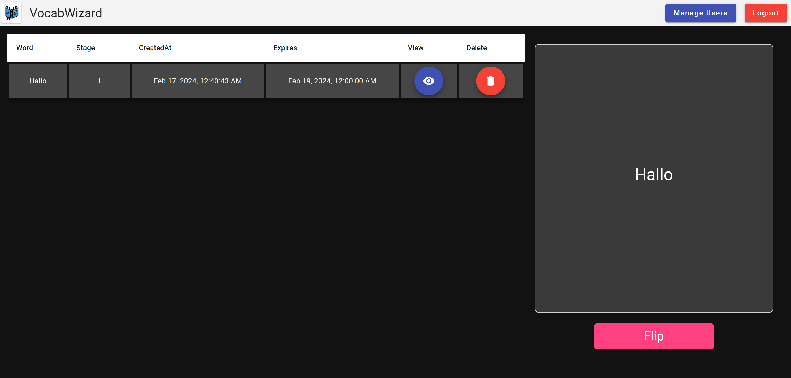<br>
Über die vorletzte Option <b>Reverse Deck</b> kann das Wort und die Übersetzung auf der Rückseite für alle Karten des Decks vertauscht werden. Wenn man auf die Option klickt erscheint ein neues frisches Deck mit genau diesen vertauschen Eigenschaften.<br>
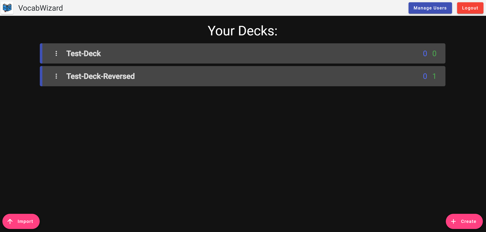<br>
Die letzte Option <b>Delete Deck</b> bietet die Möglichkeit das Deck zusammen mit allen enthaltenen Karten zu löschen.

## Technische Details
### Architektur
Die Applikation verwendet wie gefordert Angular für das Frontend und NestJS für das Backend. Außerdem wird LibreTranslate als externer Service für die Übersetzung der Wörter verwendet. Als Datenbank verwerndet die Applikation MongoDB. Um Definitionen, Beispiele, Audio etc. für ein Wort zu erhalten wird eine externe API names Dictionary API verwendet, welche über diese URL erreichbar ist: https://dictionaryapi.dev<br>
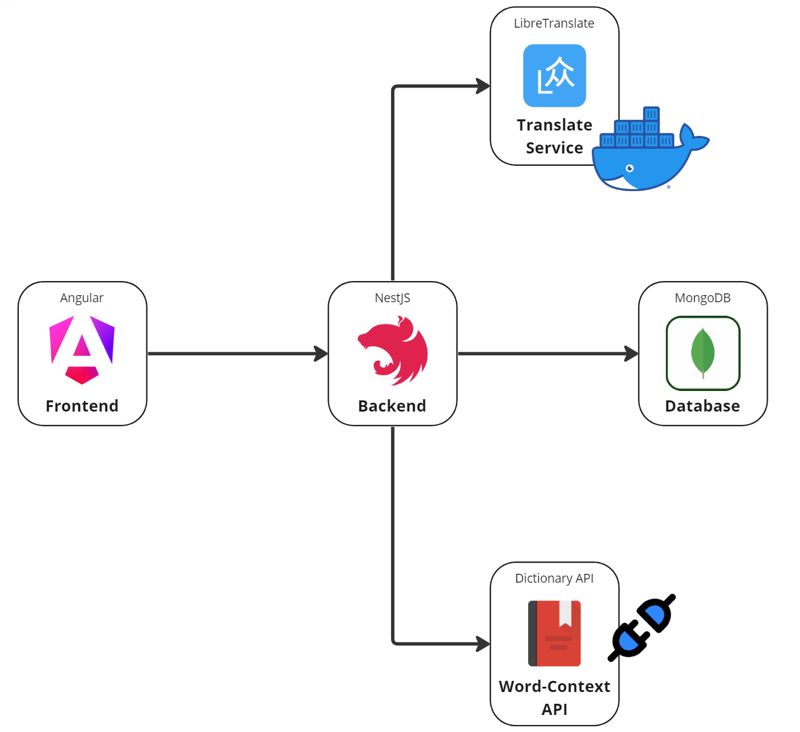<br>

### Datenbank Struktur
Die Datenbank besteht aus 3 Schemas. Ein User kann mehrere Decks besitzen. Die Felder lastTimeLearned und numCardsLearned werden im Hintergrund dafür verwendet um zu bestimmen wie viele Karten der Nutzer am aktuellen Tag noch zu lernen hat. Ein Deck kann mehrere Karten beinhalten. Über die stage wird das expires Datum berechnet, welches bestimmt wann dem Nutzer die Karte wieder zu Lernen vorgeschlagen wird. Ist expires NULL bedeutet das, dass es sich um eine neue Karte handelt. So wird im Hintergrund über neue oder zu wiederholende Karte entschieden.<br>
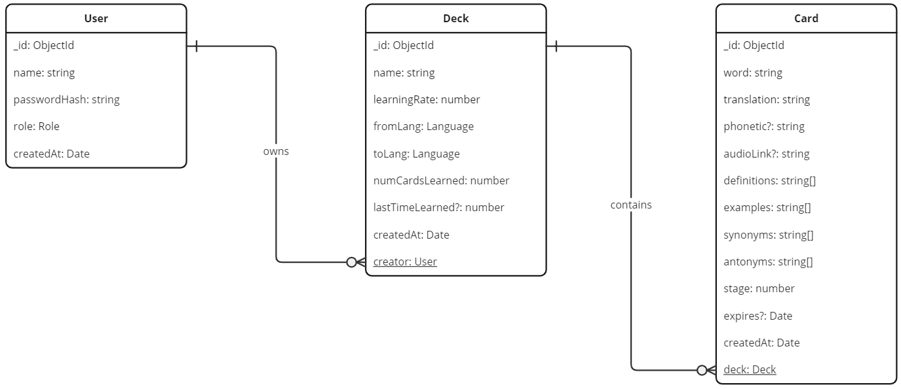<br>

### Lern-Algorithmus
Wie bereits erwähnt arbeitet das System im Hintergrund mit Stages von 0 bis 8. Aus dieser Zahl berechnet das System über die simple Formel $2^{stage}$ die Anzahl der Tage, welche zum heutigen Tag dazuaddiert werden und somit das expire Datum ergeben. Wenn der Nutzer ein Wort also gar nicht gut kann wird er in $2^0 = 1$ Tagen erneut nach dem Wort gefragt. Beherrscht der Nutzer ein Wort extrem gut wird er in $2^8 = 256$ Tagen erneut nach dem Wort gefragt. Die Tageszeit wird hierbei immer auf Mitternacht gerundet. Die Stage wird abhängig von der Stage in dem sich das Wort aktuell befindet und auf welchen Knopf der Nutzer drückt berechnet.<br>

### Admin Nutzer
Die Applikation wurde so entwickelt, dass der erste Nutzer der sich in der Applikation registriert automatisch der Admin Nutzer ist. Dieser Mechanismus vereinfacht es unter anderem in den Backendseitigen E2E-Tests Szenarien für Nutzer mit verschiedenen Berechtigungen durchzuführen.

### Schwierigkeiten und Probleme
Wie man beim Testen der App relativ schnell bemerkt, sind die Ergebnisse der übersetzten Wörter von LibreTranslate und Dictionary API oftmals nicht wirklich optimal. Vor allem wenn man von einer anderen Sprache in Englisch übersetzt sind die Ergebnisse der Dictionary API unpräzise, da zuvor noch ein zusätzlicher Übersetzungsschritt erforderlich ist. Ich hatte in der nahen Vergangenheit sogar einmal das Problem, dass die Dictionary API über einen gewissen Zeitraum nicht mehr erreichbar war. Dadurch können natürlich keine Beispiele, Definitionen etc. für neu hinzugefügte Karten erzeugt werden und auf Audio-Links die in der Vergangenheit schon einmal in meiner Datenbank abgespeichert wurden waren plötzlich nicht mehr aufrufbar. Aus diesem Grund habe ich sogar einmal überlegt die Applikation nochmal abzuändern und anstatt die automatische Übersetzung mit dem Finden von Beispielen komplett durch manuelle Nutzereingaben zu ersetzen. Da das automtische Übersetzen und Finden von Definitionen, Beispielen etc. jedoch eine Kernanforderung für meine Anwendung war und die Dictionary API bis auf wenige Ausnahmen relativ stabil war habe ich mich schlussendlich trotzdem dafür entschieden die externen APIs beizubehalten. Ich bin davon ausgegangen, dass eine nicht optimale Performance von externen Diensten und APIs sich nicht auf die Benotung meiner Applikation auswirkt. Ich hoffe, dass die Dictionary API nicht wieder unerreichbar ist während meine Anwendung geprüft wird. Ob die API erreichbar ist kann relativ einfach über den Link https://dictionaryapi.dev/ überprüft werden, indem ein Beispielwort eingegeben wird und auf die Antwort der API gewartet wird.<br><br>

Weil ich selber etwas unzufrieden mit den Ergebnissen der externen Dienste war habe ich sogar einen Versuch gestartet über die API von OpenAI und Promt-Engineering mit LangChain bessere Ergebnisse zu erzielen. Tatsächlich bietet dieser Ansatz grundsätzlich bessere Ergebnisse, wobei es natürlich immer mit etwas Risiko verbunden ist JSON von einem LLM generieren zu lassen, da zu einer geringen Wahrscheinlichkeit Formatierungsfehler vorkommen die nur schwer testbar und behebbar sind. Bei Interesse an der Technologie kann das bestehende Backend einfach mit diesem Repository https://github.com/Graf-J/vocabwizard-server-v2.git ausgetauscht werden. Die .env Datei muss für dieses Backend wie folgt aussehen, die restliche Konfiguration ist identisch zum bereits erklärten Backend.
```
MONGO_URI=mongodb://localhost:27017
JWT_SECRET=MySuperSecretJWTString
DICTIONARY_API_URL=https://api.dictionaryapi.dev
OPENAI_TOKEN=sk-xxxxxxxxxxxxxxxxxxxxxxxxxxxxxxxxxxxxxxx
```
Weil ich nicht davon ausgehen wollte, dass jeder einfach so bereit ist seine Kreditkarteninformationen bei OpenAI zu hinterlegen und die Gebühren für die Anfragen an die API zu zahlen und weil ich davon ausgehe dass die Performance externer Dienste sich nicht negativ auf meine Note auswirkt habe ich mich entschieden die komplett kostenlose Version meiner Applikation mit Libretranslate und Dictionary API abzugenben.
<br><br>

Falls bei der Bewertung meiner Applikation die Dictionary API wirklich komplett streiken sollte würde ich mich über eine persönliche Nachricht freuen, um über eine Lösung des Problems zu diskutieren. Bisher war es immer so, dass die API nach spätestens einem Tag wieder erreichbar war. Möglicherweise könnte die OpenAI Version meiner Anwendung ja noch als Alternative verwendet werden. Da sich die beiden Versionen des Backends größtenteils überschneiden wären auch für die OpenAI Version bereits einige Tests definiert.
